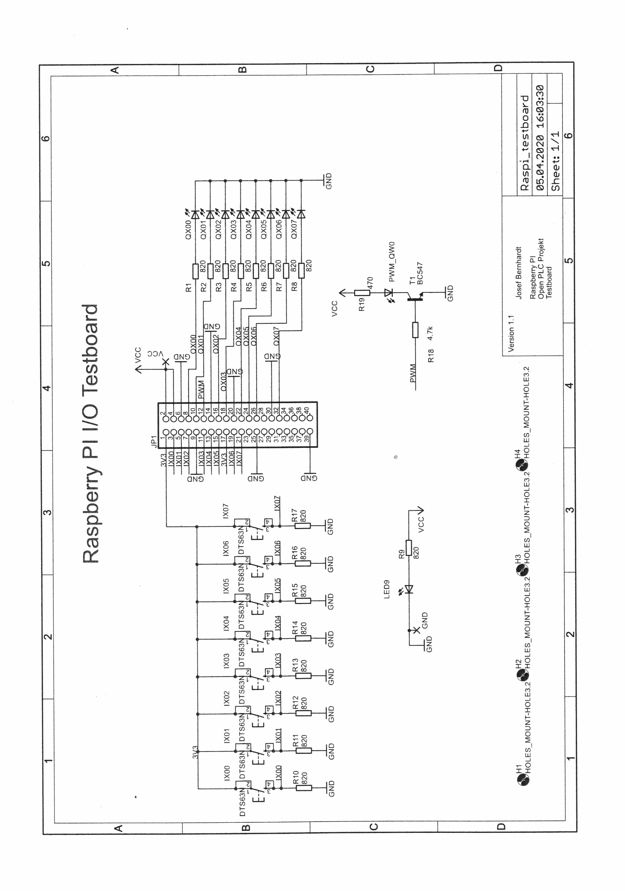
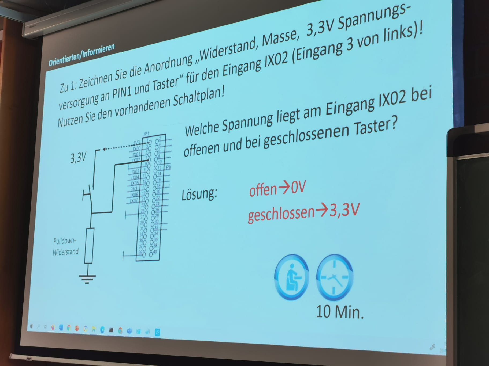
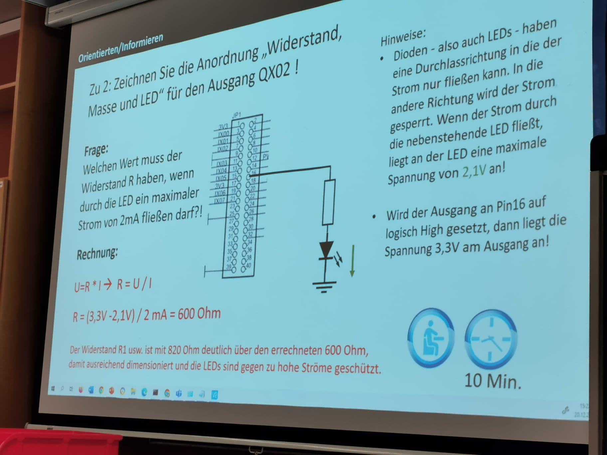
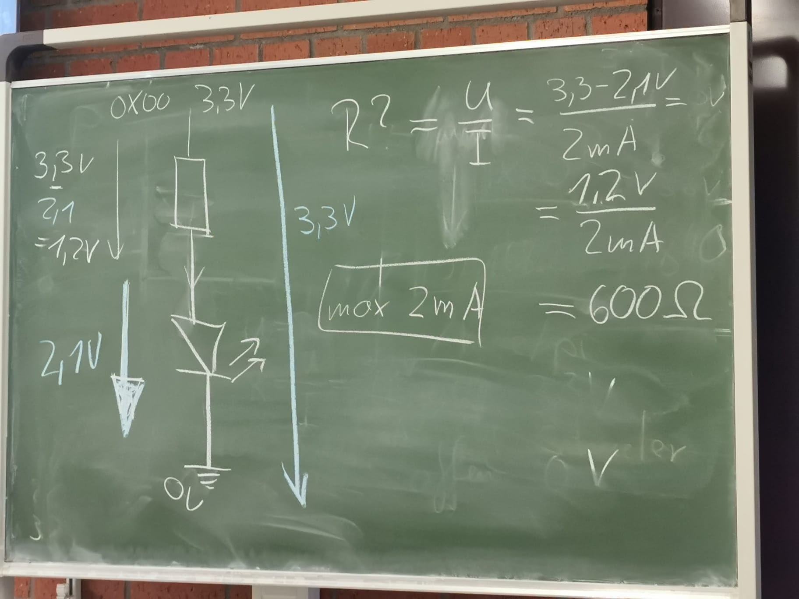
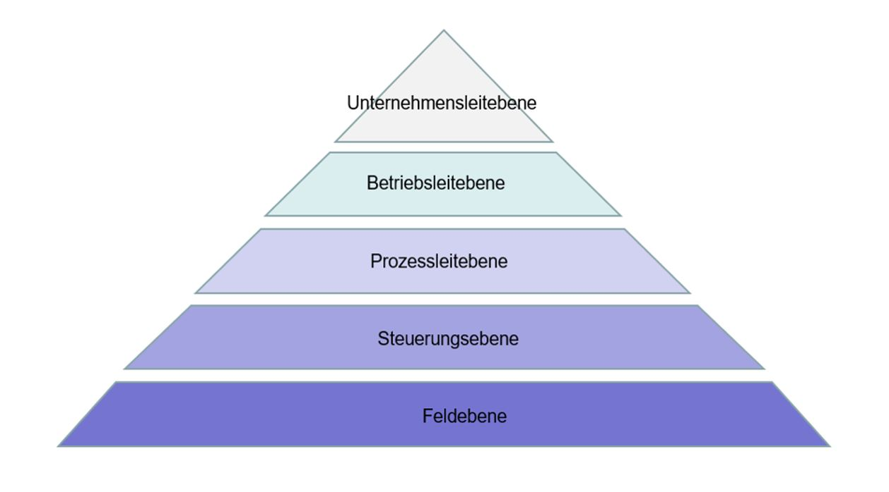

## Zusammenfassung Kurzarbeit KW 51

### Widerstände beim Raspberry Pi

- Spannung wenn Taster geschlossen ist: 3,3 V
- Spannung wenn Taster offen ist: 0 V
- Widerstand Bernhard Board: 820
- GND: Ground/Erdung -> Immer 0 V
- Eingänge des Raspi sind hochohmig -> Elektronik könnte kaputt gehen -> **Strom wird nie Richtung Raspi fließen**
- LED des Boards halten maximal 2 mA aus
- Bsp.: 3,3V + max 2mA -> 3,3 / 0,002 -> max. 1650 Ohm 
- **U = R * I**

### Fehlersuche Python

Siehe Codesnippets

### Linux-Befehle

- chmod 444 les.txt (change rights for owner, group and all others on the file les.txt to read only)

- 4: Read-Berechtigungen
- 2: Schreiben-Berechtigungen
- 1: Execute-Berechtigungen (Aufrufen über Programme; Bei Ordnern: Löschen von Dateien, des Ordners selbst)

1. Zahl: Berechtigung für den Owner der Datei (meistens Ersteller)
2. Zahl: Berechtigung für die Gruppen in denen der Owner/Ersteller ist
3. Zahl: Berechtigung für alle anderen User des Systems

### Fehlersuche Verbindung

- Layer 1: Kabel steckt nicht richtig, Pi hat keinen Strom etc.
- Layer 2: ???
- Layer 3: Laptop ist nicht im selben Netz wie der Pi

### Horizontale Kommunikation

- **Kommunikation innerhalb einer Ebene der Automatisierungspyramide**
- Kommunikation zwischen Sensoren auf Leitebene über BUS-Kabel, ASI (Actuator-Sensor-Interface)

### Automatisierungspyramide

- Unternehmensleitebene: CEO
- Betriebsleitebene: Leitstellen, Überwachungsstellen bei Power Plants
- Prozessleitebene: Prozesse
- Steuerungsebene: HMI für Anzeige von Sensorenwerten, Steuerungen
- Feldebene: Sensoren, Motoren, Verbindungskabel

### SCADA

Supervisory Control and Data Acquisition

- Überwachung und Steuerung der Anlagen
- Grafische Übersicht der Gesamtanlage über NW mit Live-Update der einzelnen Stationen
- Heute SCADA-Systeme herstellerunabhängig
- Erfassung sämtlicher relevanter Prozess- und Maschinendaten (z.B. in SQL-basierten DB)
- Intuitives Bedienen und Beobachten der Stationen über HMIs oder Monitore
- Meldesystem für Fehler
- Service- und Instandhaltungsfunktionen
- Energiemanagement

Ein SCADA-System für das Autohaus Nettmann müsste, damit es dir Forderungen des Pflichtenhefts erfüllt, Folgendes "können":

- ... es müsste eine aktuelle grafische Übersicht des Zustands der Werkstatttore

